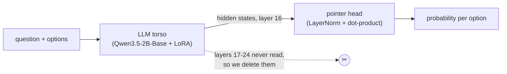
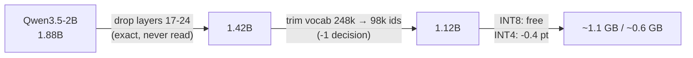

# Can a smaller model match AWS Strands Decider 2B?

**TL;DR** A 1.12B decision model trained on ~10k rows (Strands used ~123k) scores 167/231 on JevBench, tying Strands Decider 2B. A 3-seed ensemble of the 1.88B version scores 171/231, four decisions ahead. The lead comes from data and ensembling, not architecture, and falls within one standard error. Strands still has better calibration (Brier).

## Why

- [TypeSafe's Jev launch](https://typesafe.ai/blog/introducing-system-one-models-and-jev) drew attention to decision models: given a question and developer-supplied options, a small model picks one in a single forward pass and generates no text.
- AWS released [Strands Decider 2B](https://huggingface.co/StrandsAgents/strands-decider-2B-hobson-v19), which scores 167/231 on JevBench with 1.9B parameters.
- I wanted to know whether an automated architecture search could find a smaller model that matches it.

## What a decision model is

Remove the text-generating head of an LLM. A small head then reads the hidden states of the options and scores them directly.

One forward pass takes ~0.05 s on a GPU and returns calibrated probabilities.

## How

I ran [autoresearch](https://github.com/gabrielfior/decision-models-experiments): an agent loop that proposes a change, trains, scores a held-out dev split, and keeps the change only if it gains more than 2 standard errors. I touched JevBench's 231 public decisions only at milestones.

**What the search found**

| Lever | Result |
|---|---|
| Read-out depth (frozen torso) | Middle layers beat the last: layer 16 scored 0.437, layer 24 scored 0.399. LFM2.5 and ModernBERT show the same pattern. |
| Head architecture | A plain pointer head saturates its softmax on layer-24 states (norm ~120). One LayerNorm fixes it. |
| LoRA on the torso | Head design stops mattering (seed noise of 0.02 exceeds any head effect). |
| Other torsos (MiniCPM5, LFM2.5-2.6B, granite-swash, Qwen3.5-0.8B) | All lost to Qwen3.5-2B-Base on JevBench (134-158 vs 165-171). MiniCPM5 won on our dev set and lost on JevBench, so I rank torsos by JevBench alone. |
| More training rows (8k → 9.9k) | +4-10 decisions, the biggest lever. |
| Two-order averaging, 3-seed ensemble | +2-3 decisions each. |

**Why read from layer 16 instead of the last layer?** More layers do not give more signal for this job. The last layers specialise in predicting the next token, and we threw that part away. The middle layers hold general, meaning-level features, and "which option fits this question" is a meaning-level comparison. On three unrelated architectures, accuracy peaked mid-stack and fell toward the top. Reading layer 16 of 24 also lets us delete layers 17-24 for free, since they never influence an answer. Two caveats: with LoRA on, the exact depth matters less (seed noise exceeds the effect), and cutting too deep hurts (12 layers scored 146).

**Inspiration from Cactus** ([Needle](https://github.com/cactus-compute/needle), [blog](https://cactuscompute.com/blog/needle)): their from-scratch 26-121M models do not graft onto a pretrained torso, but three of their ideas carry over. Score from an intermediate layer, cut the model at the layer you read, and shrink the embedding table (dead weight for a scorer). Together they take 1.88B to **1.12B** with no measurable loss.

**How this differs from Strands**

Very little. Both start from [Qwen3.5-2B-Base](https://huggingface.co/Qwen/Qwen3.5-2B-Base), add a rank-16 LoRA, and replace the LM head with a ~1M-parameter pointer head ([model card](https://huggingface.co/StrandsAgents/strands-decider-2B-hobson-v19)). Both follow the recipe of [Kev](https://github.com/jaredpalmer/kev), the open Jev-style family.

| | Strands Decider 2B | This work |
|---|---|---|
| Torso, LoRA, pointer head | Qwen3.5-2B-Base, r16, ~1M head | same |
| Read-out | Final hidden states ([repo README](https://github.com/strands-labs/strands-decider)) | LayerNorm'd states from layer 16 |
| Size | full, 1.9B | cut to 16 layers, vocab trimmed: 1.12B |
| Training rows | ~123k | 8k-9.9k from Kev's decision-v7 |
| Inference | one pass | two option orders averaged; 3-seed ensemble for the top score |

**Training data**

| | Strands Decider 2B | This work |
|---|---|---|
| Rows | ~123k | 8k (9.9k with two held-out families: TREC, legacy policy) |
| Source | Public datasets (inventory in their GitHub repo) | [decision-v7](https://huggingface.co/datasets/jaredpalmer/kev-suites) (Kev): 10 public datasets (AG News, Amazon, Banking77, BoolQ, DBpedia, IMDB, MNLI, SST-5, TREC, Yelp) plus generated policy and rule examples. No distillation from other decision models. |

**Contamination check.** JevBench items are authored from scratch; decision-v7 comes from public NLP datasets plus generated rows. None of the 231 public JevBench items shares a run of 8 words with any of the 12,576 decision-v7 records.

## Results

JevBench public, 231 decisions. Our scores average two option orders.

| Model | Params | Rows | Correct | Accuracy | Brier ↓ |
|---|---|---|---|---|---|
| Strands Decider 2B v19 | 1.9B | ~123k | 167 | 0.723 | **0.342** |
| Ours, 8k rows, 3 seeds | 1.88B | 8k | 160-167 | 0.69-0.72 | 0.37-0.39 |
| Ours, 9.9k rows, best seed | 1.88B | 9.9k | 171 | 0.740 | 0.370 |
| Ours, 9.9k rows, 3-seed ensemble | 1.88B (×3) | 9.9k | **171** | **0.740** | 0.364 |
| **Ours, exported** | **1.12B** | 9.9k | 167 | 0.723 | 0.372 |
| Ours, Qwen3.5-0.8B | 0.8B | 9.9k | 152 | 0.658 | 0.442 |

Caveats:

- Four decisions out of 231 is about one standard error: call it a tie with a slight edge.
- The edge comes from 24% more data (the two held-out families), not architecture. On the original 8k rows, every variant ties Strands.
- The 0.8B model gained nothing from the extra data; the data lever needs capacity.
- Strands is better calibrated (Brier 0.342 vs 0.364), and I did not close that gap.
- I looked at JevBench at milestones and used it to pick the torso, the two-order averaging, and the 9.9k-row training set. That adapts our choices to these 231 items, so single-seed scores (such as the best seed's 171) are the most exposed. Strands iterated on it too (v17 to v19).
- Generated policy and compositional rows may resemble JevBench's policy and routing items in structure. That is a style match, not leakage.
- I could score only the public split; the private split is out of reach.

Code, logs, and all 76 scorings: https://github.com/gabrielfior/decision-models-experiments
