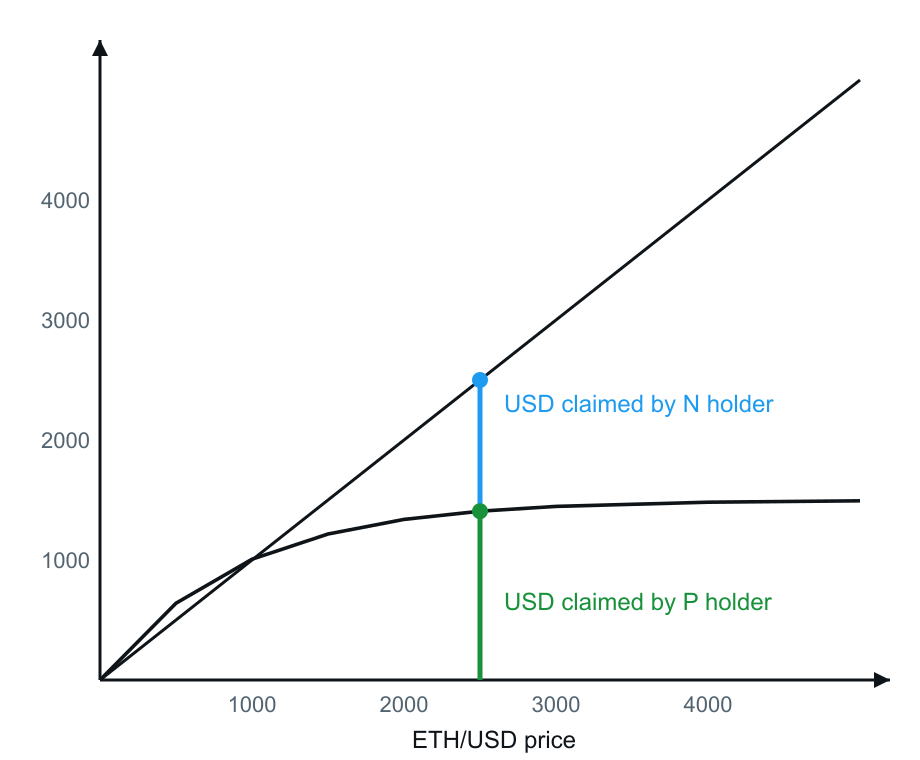
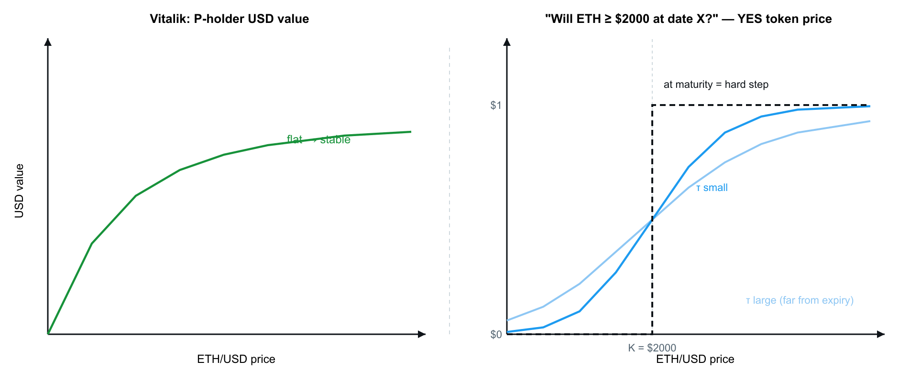
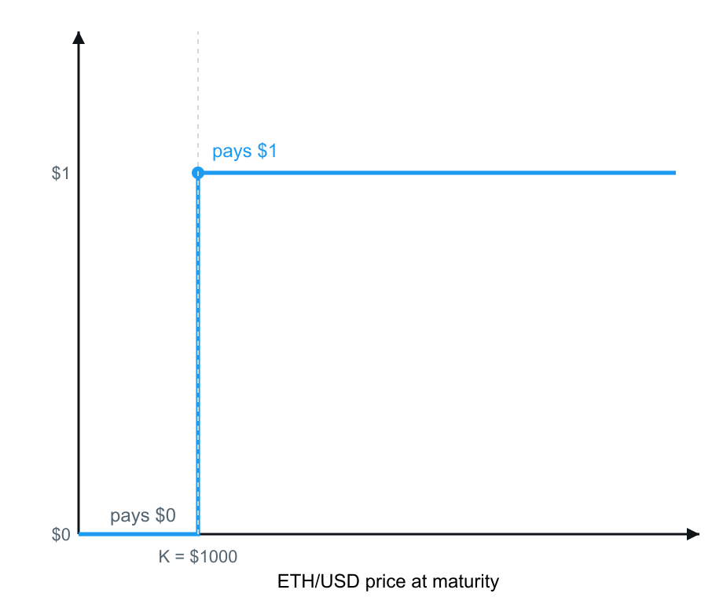
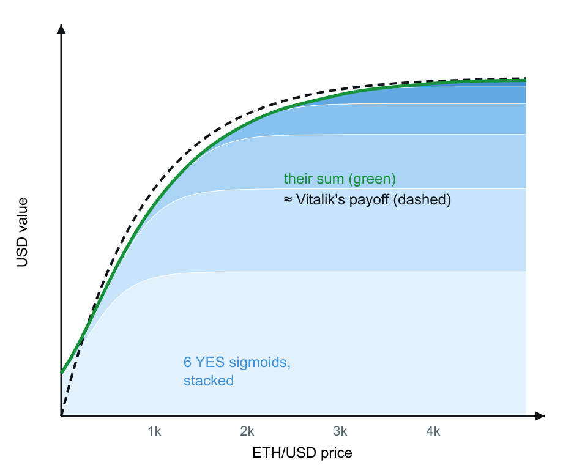
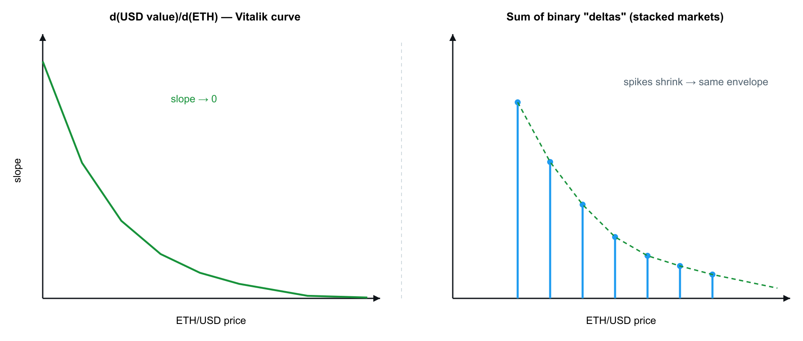

# Stablecoin via Prediction Markets: Debt-Free Pegs from Binary Outcome Tokens

> **tl;dr:** Vitalik Buterin proposes splitting 1 ETH into two option-backed claims — one stable (P), one upside (N) — with no CDP, liquidations, or collateral ratios. We show that the stable leg's payoff shape can be approximated by a weighted basket of YES tokens from existing binary prediction markets. The curve geometry works; strike management, oracle risk, and rebalancing fees determine whether it is deployable.

---

## Background: Options Instead of Debt

In [*Building index-tracking assets on top of options instead of debt*](https://ethresear.ch/t/building-index-tracking-assets-on-top-of-options-instead-of-debt/25036), Vitalik Buterin describes a stablecoin design that does not rely on over-collateralized debt positions. The construction splits 1 ETH along the diagonal into two claims that always sum back to ETH:

| Claim | Role | Payoff shape |
|---|---|---|
| **P** | Stable leg | Concave: USD value rises with ETH at first, then saturates |
| **N** | Upside leg | Linear: holder keeps full ETH exposure above the split |

There is no liquidation threshold and no collateral ratio to monitor. The stable behavior comes from the **geometry of the payoff**, not from a peg maintained by arbitrage against a vault.

The open question we explore here: **can the P-leg curve be replicated with binary prediction markets that already trade on-chain?**

---

## The Target Payoff

The design goal is a token whose USD value remains approximately flat as ETH spot moves within a target band.

The P holder's claim is the lower, flattening portion of the ETH diagonal. In USD terms, value increases with ETH price at low spot levels, then levels off — the flat tail is what produces stablecoin-like behavior.

*Figure 1. Vitalik's payoff decomposition. The N holder retains full ETH upside (diagonal). The P holder's USD value saturates (concave curve). The flat tail on the P leg is the stable region.*

---

## Prediction Markets Produce the Same Curve Family

Before a binary market resolves, a YES token does not discontinuously jump from \$0 to \$1 at the strike. Its live price equals implied probability — a smooth "soft step" that sharpens into a hard step only as expiry approaches (\(\tau \to 0\)).

For a market of the form "ETH ≥ K at time T," the YES price tracks:

$$q(S) \approx P(\text{ETH}_T \geq K)$$

*Figure 2. Comparison of Vitalik's P-holder curve (left) with a prediction-market YES token price before resolution (right). The soft step is the same functional family as the saturating stable leg. Stacking multiple such curves at different strikes reconstructs the full payoff.*

---

## Building Block: A Single Binary

Consider one market:

**"Will ETH ≥ \$1,000 on 01.07.2026?"**

At expiry the YES token pays \$0 below the strike and \$1 at or above — a single hard step.

*Figure 3. Payoff of one YES token at strike K = \$1,000: zero on [0, 1000), one on [1000, ∞).*

One binary alone is insufficient. It becomes useful as a **building block** when combined with others.

---

## Reconstruction: Stacked Strikes

With ETH at \$2,000, a basket can hold YES tokens at rising strikes (\$1,000, \$1,500, \$2,000, …) with decreasing weights at higher strikes.

| Phase | Basket behavior |
|---|---|
| **Before expiry** | Each leg is a soft sigmoid \(q_i(S)\). The weighted sum \(\sum w_i \cdot q_i(S)\) is a smooth, saturating curve. |
| **At maturity** | Each sigmoid collapses to a hard step. The sum becomes a staircase. |

*Figure 4. Weighted sum of YES-token prices before expiry. Individual legs are soft steps; their sum matches Vitalik's saturating P payoff. Shrinking weights at higher strikes produce the flat tail. At maturity, each leg resolves to a hard step and the sum becomes a staircase.*

---

## Worked Example: Basket Behavior Across Spot Moves

Assume a basket marked near \$1 with ETH at \$2,000 and strikes placed below spot (approximately \$1,000–\$1,500).

| ETH spot | Basket USD mark | Mechanism |
|---|---|---|
| \$3,000 | ~\$1 | Stable leg has saturated; holder forfeits further ETH upside |
| \$1,200 | ~\$1 | Strike buffer still intact |
| Below strikes | → \$0 | Basket loses stable behavior; payoff becomes ETH-like on the downside |

**Above the strike ladder, the basket is stable. Below it, the holder bears ETH downside.** This is the fundamental tradeoff of the construction.

---

## Active Management Requirements

Unlike a static options portfolio, a prediction-market basket requires ongoing maintenance:

1. **Downward drift** — If ETH approaches the strike ladder, strikes must be rolled lower to rebuild the buffer before the peg slips.
2. **Upward drift** — If ETH moves far above the ladder, strikes should be re-centered higher to avoid leaving upside on the table.
3. **Expiry rolls** — Binary markets have fixed maturities. Positions must be rolled forward; each rebalance incurs trading fees.

CDP-based stablecoins carry their own maintenance burden (liquidation risk, governance, oracle lag). This design **substitutes** those risks for active strike management and roll costs. Neither approach is passive.

---

## Stability Intuition: Derivative Goes to Zero

The stable "feel" of the P leg can be understood through its slope with respect to ETH spot.

On Vitalik's curve, the derivative decays toward zero in the flat tail — USD value barely moves when ETH rises further. The PM basket exhibits the same property: binary deltas shrink as spot moves above the strike ladder.

*Figure 5. Left: derivative of Vitalik's payoff, decaying to zero in the flat region. Right: \(\partial/\partial S \sum w_i \cdot \mathbf{1}\{S \geq K_i\} = \sum w_i \cdot \delta(S - K_i)\) — impulses at each strike whose smoothed envelope reproduces the same decaying slope.*

The basket achieves "almost flat" USD sensitivity in the target band. Converting that into a **hard \$1 peg** — exact rather than approximate — remains an open engineering problem.

---

## Implications

A weighted basket of YES outcome tokens from live prediction markets can approximate a **debt-free, stablecoin-like payoff** without a CDP, liquidations, or collateral ratios.

Whether this is a viable product depends on parameters we have not yet fully quantified:

| Factor | Risk |
|---|---|
| **Strike spacing** | Too wide → peg slips between strikes; too narrow → more legs, more fees |
| **Oracle risk** | Resolution depends on correct ETH price at expiry |
| **Fee drag** | Rolling and rebalancing across many binaries compounds trading costs |
| **Liquidity depth** | Thin markets at far strikes widen effective spreads |

---

## What's Next

We are currently working through the following:

1. **Backtests** — Simulate basket marks and rebalancing costs across historical ETH paths
2. **Strike calibration** — Quantify spacing and weight schedules that minimize peg deviation
3. **Fee sensitivity** — Model break-even fee thresholds against CDP stablecoin carry costs

**→ Primary reference:** [Building index-tracking assets on top of options instead of debt](https://ethresear.ch/t/building-index-tracking-assets-on-top-of-debt/25036) (Vitalik Buterin, ethresear.ch)

---

*Charts recreated from Vitalik's article figure. The derivative panel in Figure 5 is the analytical derivative of that curve.*
